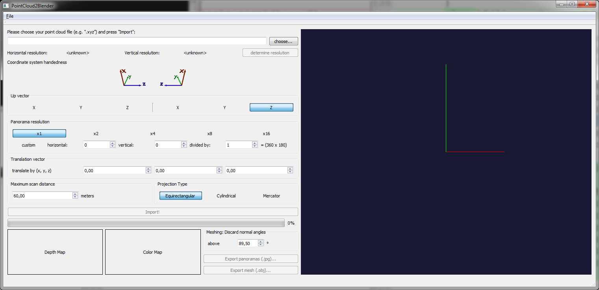

PointCloud2Blender
========

Convert point cloud files to Blender 3D meshes.

This is a software project for converting laser scanner point clouds (e.g. .xyz or .ply files) to a file format for use in Blender 3D (e.g. .obj).

- [Homepage](http://bachelor.kalisz.co)

Table of contents
=================

- [PointCloud2Blender](#pointcloud2blender)
- [Table of contents](#table-of-contents)
- [Intro](#intro)
- [Dependencies](#dependencies)

Intro
=====

This software is being developed during my bachelor thesis at the Technische Hochschule Georg-Simon-Ohm university in Nuremberg, Germany.

The goal of my work is to reconstruct the Pellerhaus from 1602 before its destruction as a 3D model. Laser scanning (LiDAR) will provide the state today, the missing parts will be created using the open source graphic suite Blender 3D.
The motivation for creating this software is to provide a way to use colored point clouds in Blender. Usually Blender is not capable of displaying colored points. By creating a mesh and assigning texture coordinates I attempt to overcome this problem. The results of my thesis will show whether this is a good solution, from a designers perspective.

Dependencies
============

Currently: Qt 5
Planned: PCL, OpenVDB

